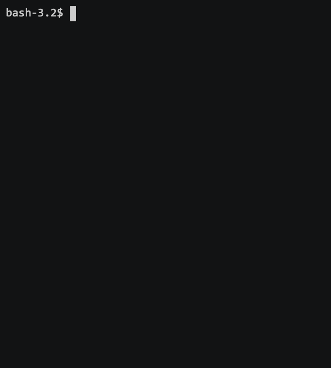

# terminal-snake

Play snake in the terminal!



Gif made with [asciinema](https://github.com/asciinema/asciinema-player)

## Build & run

```
$ stack run
```

## Controls

* `s` to turn left
* `d` to turn right


## Extensions

* Allow speed and board size as arguments to the program.
